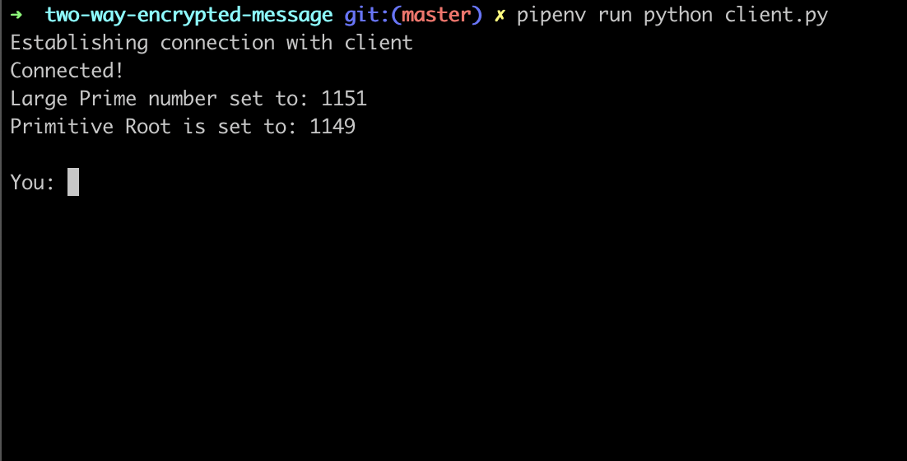
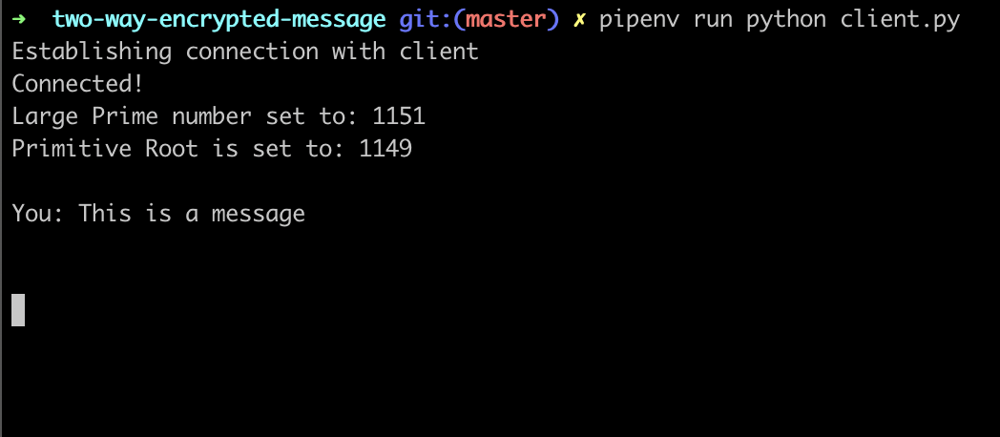
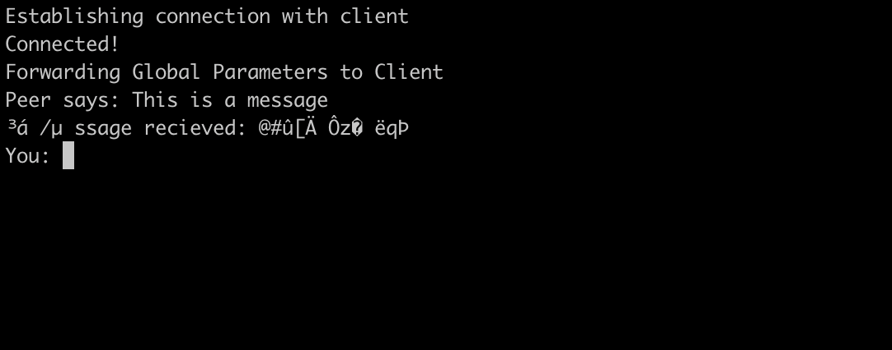
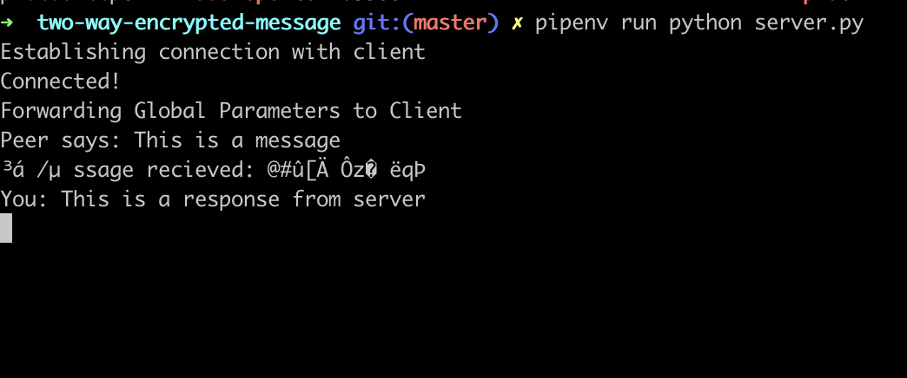
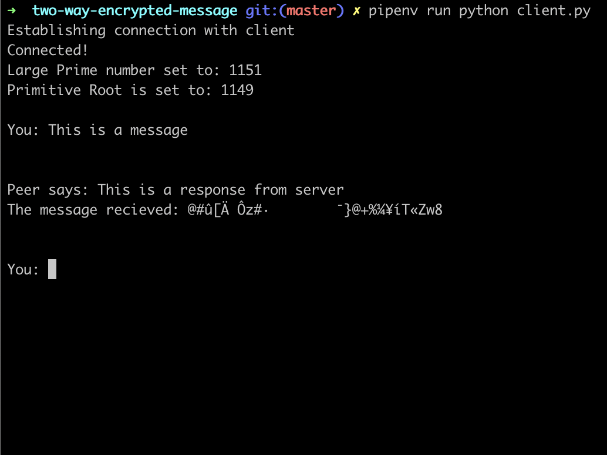

# Two-Way-Encrypted-Messaging
#### Using DES and Diffie-Hellman

In this project, using a client-server architecture to show the mechanism, I have implemented encryption-decryption procedure using DES and Diffie-Hellman Key Exchange. The steps regarding the algorithm are already in the files as comments at every step. The algorithms are:

  1. DES (Data Encryption Standard): It is a symmetric key algorithm which one can crack with brute force in 2^56 iterations.
  2. Diffie-Hellman Key Exchange: It is the key exchange algorithm in order for the interacting systems to derive to the same shared key that will be used by DES for the encryption-decryption purposes.

The basic steps involved would be:
  1. The server would be listening for any incoming requests to connect to a client
  2. The client will send a request for connection and after the TCP 3-Way Handshake, the client and server can start talking to each other one after the other.
  3. The global parameters are selected by the server and the client is notified of them
  4. The public-private key pair are generated and public keys are exchanged to get the session key to be used for DES
  5. The message the sender wants to send is encrypted and encoded and sent to the receiver.
  6. The receiver would decode and decrypt the message and print the message on the terminal

### To Run:

If you don't have pipenv, install it. On mac that can be easily done with `brew install pipenv`

* `pipenv install`
* `pipenv sync --dev`
* `pipenv run python server.py`
* `pipenv run python client.py`

### What the CLI Program Does:
##### Starting the client and establishing a connection to the server

##### Starting the server

##### On the client, preparing to send a message which will be encrypted to the server.

##### Once connection is established, will prompt that it is connected. Photo below shows the server recievd an encrypted message from the client - I typed and sent "This is a message" - it decrypted it and printed the string to the console.

##### Once message is recieved, server is prompted to give a response. Here I have typed "This is a response from the server".

##### Client receives the encoded and encrypted message and decodes it and prints it to the console.

